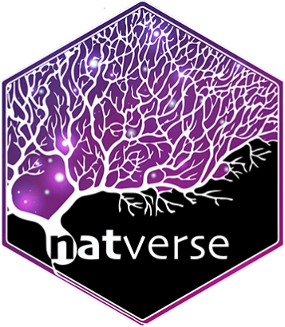

# nat: NeuroAnatomy Toolbox  
<!-- badges: start -->
[](https://natverse.org/)
[](http://dx.doi.org/10.5281/zenodo.10171) 
[](https://github.com/natverse/nat/releases/latest) 
[](https://cran.r-project.org/package=nat) 
[](https://github.com/natverse/nat/actions)
[](https://codecov.io/gh/natverse/nat)
[](https://natverse.org//nat/reference/)
[](https://www.r-pkg.org:443/pkg/nat)
<!-- badges: end -->

An R package for the (3D) visualisation and analysis of biological image data, especially tracings of
single neurons. **nat** is the core package of a wider suite of neuroanatomy 
tools introduced at http://natverse.github.io. **nat** (and its [ancestors](https://github.com/jefferis/AnalysisSuite))
have been used in a number of papers from our group including:

[](http://dx.doi.org/10.1016/j.cell.2007.01.040)
[](http://dx.doi.org/10.1016/j.cub.2010.07.045)
[](http://dx.doi.org/10.1038/nature10428)
[](http://dx.doi.org/10.1016/j.cell.2013.11.025)
[](http://dx.doi.org/10.1016/j.neuron.2016.06.012)


## Quick Start

For the impatient ...

```r
# install
install.packages("nat")
# use
library(nat)

# plot some test data (?kcs20 for details)
# Drosophila Kenyon cells processed from raw data at http://flycircuit.tw
head(kcs20)
open3d()
plot3d(kcs20, col=type)
# get help
?nat
```

## Installation

A confirmed stable version of **nat** can be installed from CRAN. 

```r
install.packages("nat")
````

However, **nat** remains under quite active development, so if you will be 
using **nat** extensively, we generally
recommend installing the latest development version directly from github using
the [devtools](https://cran.r-project.org/package=devtools) package.

```r
# install devtools if required
if (!requireNamespace("devtools")) install.packages("devtools")
# then install nat
devtools::install_github("natverse/nat")

```
## Learn

To get an idea of what **nat** can do:

* Skim through the Articles listed at https://natverse.org//nat/
* Take a look at the [R Markdown](https://rmarkdown.rstudio.com/) reports used 
  to generate the [figures for our NBLAST paper](http://flybrain.mrc-lmb.cam.ac.uk/si/nblast/www/paper/).

When you're ready to learn more:

* Read the [overview package documentation](https://natverse.org//nat/reference/nat-package.html)
  (`?nat` in R)
* Read the [Introduction to neurons](https://natverse.org//nat/articles/neurons-intro.html) article
* Check out the thematically organised [function reference documentation](https://natverse.org//nat/reference/). 
  * Most help pages include examples.
* Try out sample code:
  - [nat.examples](https://github.com/natverse/nat.examples) has detailed 
    examples for data sets from a range of model organisms and techniques
  - [frulhns](https://github.com/jefferis/frulhns) analysis of sexually dimorphic circuits
  - [NBLAST figures](https://github.com/jefferislab/NBLAST_figures/)

## Help
If you want some help using **nat**:

* For installation issues, see the [Installation vignette](https://natverse.org//nat/articles/Installation.html)
* Contact [nat-user](https://groups.google.com/forum/#!forum/nat-user) Google group - 
  we normally respond promptly and you will also be helping future users.

If you think that you have found a bug:

* Install the development version of nat using devtools (see above) and see if 
  that helps.
* Check the [github issues](https://github.com/natverse/nat/issues?q=is%3Aissue) and 
  - [file a  bug report](https://github.com/natverse/nat/issues/new) if this seems to be a new problem
  - comment on an existing bug report 

Thanks for your interest in **nat**!
