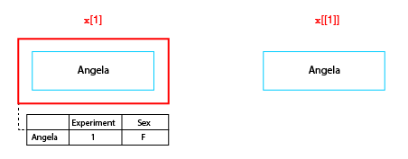

## Preface
This vignette is designed to give you a good introduction to some of the key
features of nat by teaching you about how it handles individual neurons and 
collections of neurons.

The source code for this vignette is available at 
https://github.com/natverse/nat/blob/master/vignettes/neurons-intro.Rmd. 
If you find something unclear or notice a typo, I would be very happy if you 
would click on the Pencil Icon on that page or follow 
[this link to edit](https://github.com/natverse/nat/edit/master/vignettes/neurons-intro.Rmd)
and suggest an alternative wording. Don't be shy about doing this; I have to 
review any change and even if your suggestion is not perfect it will still
be a prompt for me to improve this document. Thank you!

## Startup
Install the package if required
```{r install, eval=FALSE}
install.packages('nat', dependencies = TRUE)
```

Load the package
```{r, message=FALSE}
library(nat)
```

```{r, include=FALSE}
# set up for knitr / 3D snapshot figures
rgl::setupKnitr()
library(knitr)
opts_chunk$set(fig.width=5)
# to avoid issues on CRAN when webshot2/rmarkdown unavailable
use_rgl=requireNamespace('webshot2', quietly=TRUE) && requireNamespace('rmarkdown', quietly=TRUE) &&
  rmarkdown::pandoc_available()
```

## Neurons and Neuronlists
There are a number of basic built in types of data in R such as vectors and matrices, 
but it is also very easy to define new data types with specialised features to 
enable powerful and efficient analysis of particular kinds of data. These specialised
data types are called *classes* and a specific instance of a class is an *object* 
(a neuroscience analogy: this is the difference between talking about the
general class of mitral cells and the specific cell that you just sealed onto
with your patch clamp electrode.)

We will look at two key classes that **nat** defines for handling 3D structures of neurons

* `neuron`
* `neuronlist`

### Sample Data
As an example we're going to look at a data set of olfactory projection neurons originally 
published as Supplemental Information to accompany 
[Jefferis, Potter et al, Cell (2007)](http://dx.doi.org/10.1016/j.cell.2007.01.040).
A subset of the original data are distributed as a sample data object with the
**nat** package, which we can load like so.

```{r}
data("Cell07PNs")
```

For more information about these data see [Cell07PNs](http://natverse.org/nat/reference/Cell07PNs.html).

This `Cell07PNs` object has two classes `neuronlist` and the base class `list`

```{r}
class(Cell07PNs)
```

Many R objects inherit from the base class `list` (objects can have multiple 
classes in the same way that a mitral cell is also neuron) because this is a
convenient container class into which you can put a variety of different kinds 
of data. In this case the `Cell07PNs` `neuronlist` contains `r length(Cell07PNs)` objects:

```{r}
length(Cell07PNs)
# access the first neuron in the neuronlist
class(Cell07PNs[[1]])
```

each representing a traced neuron. We will now look in detail at these two classes.

## Neurons

We start by extracting the first neuron in Cell07PNs, and assigning it to
a variable. We can then plot the neuron so that we have an image of what we are
talking about.

```{r}
n1=Cell07PNs[[1]]
plot(n1)
```

### Neuron internal structure

The `str` function (short for structure) allows us to take a look at the internal
structure of this neuron object.

```{r}
# Use =1 so that we don't show complete structure
# for objects inside n1
str(n1, max.level=1)
```

From this you can see that there are a large number of fields inside the neuron.
Each field can be accessed using the `$` or `[[` operators

```{r}
n1$NumPoints
n1[["NumPoints"]]
```

There are a set of core fields (described in `?neuron` documentation); the key 
ones will be described shortly. However there are also quite a few user fields
in this neuron and you can safely add any field you like so long as its name 
does not clash with an existing field. For example:

```{r}
n1$Comment='The sex of this specimen is uncertain'
```

The single most important field in a neuron is the `$d` `data.frame`. This 
contains a block of data closely reminiscent of the SWC data format for traced 
neurons:

```{r}
str(n1$d)
```
Each row defines a node in a branched tree with a unique integer identifier,
`PointNo`, normally but not always sequentially numbered from 1. The `X,Y,Z` 
columns encode the position of each vertex and the `W` column encodes the 
diameter of the neurite at that position.

### Methods for neurons
R's simple [S3 object oriented system](http://adv-r.had.co.nz/OO-essentials.html)
allows specialised functions for particular classes to be defined. These functions
tailored to a particular class are called *methods*. Methods can be provided for
pre-existing functions supplied with base R as well as new user-written functions.
The system is quite simple. If a function `foo` is defined as a *generic* function
then you can define new functions called `foo.bar` that will be called when
you write `foo(x)` and `x` has class `bar.

We already used one such method without comment, `plot.neuron`. There is a base
R function called `plot`. nat defines a new function called `plot.neuron`, which
R interprets as a `plot` method specialised for `neuron` objects. When the base
R `plot` function is called, it looks at the class of its first object to see
whether a specialised method exists. If there is none, it will use a fallback
method called `plot.default`.

The `plot.neuron` method interprets the branching structure of a neuron and
draws line segments joining up the connected nodes at the appropriate 2D positions.
You can compare it with what you would get if you just plotted the XY position 
of all nodes joined together by a single line:
```{r}
plot(n1$d$X, n1$d$Y, type = 'l')
```

You can find out what methods are available for a particular class like so:

```{r}
methods(class = 'neuron')
```

You can then find the help page for any method in the console with `?plot.neuron`. 
Note that if you write `?plot` you will get the documentation for the basic 
`plot` function supplied with R.

It is also good idea to look at 
[nat's function reference page](http://natverse.org/nat/reference/index.html)
which groups available functions into categories that often reflect the class
of object they can work on.

In R, operators such as `*` or `+` are actually special functions with two 
arguments, so one can add methods for these in the same way. In the following
example we use this arithmetic to shift a neuron by a small amount:

```{r}
plot(n1, col = 'black', WithNodes = F, main="Shifting neurons")
# shift by 3 microns in x,y,z
plot(n1+3, col = 'red', add = TRUE, WithNodes = F)
# shift by -5 microns in y
plot(n1+c(0,-5,0), col = 'blue', add = TRUE, WithNodes = F)
```

Another specialised method is `subset.neuron` which we can use to extract part
of a neuron into a new object. For example, a simple spatial criterion, 
X location must be >240, is used to extract the axon terminal arborisation field
in this example

```{r}
plot(n1, col = 'black', WithAllPoints = T, main="Subsetting a neuron")
# keep only nodes with X position >20
n1.lh=subset(n1, X>240)
# plot the selected part of the neuron in blue
plot(n1.lh, col='blue', lwd=3, add=TRUE)
# add a line illustrating the cut point
abline(v=240, lty=2)
```

We can also summarise the morphological properties of a neuron using the
`summary.neuron` method, which allows us to compare measurements for the original
neuron and the axon arbour that we just cut out above.

```{r}
summary(n1)
summary(n1.lh)
```

See [nat's function reference page](http://natverse.org/nat/reference/index.html)
for additional functions for working with neurons.

## Neuronlists
The `data` statement above loaded a `neuronlist` object called `Cell07PNs` 
containing `r length(Cell07PNs)` `neuron` objects. `neuronlist` objects are key 
data structures in nat for convenient handling of collections of neurons.


The diagram above presents the structure of a neuronlist, `x`, which contains
5 neurons. The main structure is an R `list` object, which in this case contains
5 slots. Each slot contains a neuron with a unique name. In addition to this 
list of neurons there is an optional attached `data.frame` (another standard R class).
When present, each neuron in the main list must have a matching row in this `data.frame`.

Neuronlists can be manipulated use the square bracket subscript operator to 
extract or replace a subset of their elements. Crucially when this happens the
corresponding rows of the attached metadata are also selected as diagrammed for 
the result of x[1:3] (right hand side of figure above).

When subscripting any list in R, it is very important to understand the difference 
between using the single and double bracket operator. We can illustrate this
difference as follows:



The single bracket operator makes a new list containing a specified subset of
elements in the original list, while the double bracket operator extracts the
object at the given position. So in the figure `x[1]` is a `neuronlist` object
of length 1, whereas `x[[1]]` is the `neuron` object at the first position in 
the list.

### Worked Examples

Let us start by extracting the first five neurons from our sample data.

```{r}
# we can select neurons by indexing 
first5=Cell07PNs[1:5]
summary(first5)
```

Each neuron in the neuronlist has an associated name which can be used to select
it. We can get the names of all neurons using the `names` function.

```{r}
names(Cell07PNs)
nl3=Cell07PNs[c("EBH11R", "EBH20L", "EBH20R")]
all.equal(nl3, Cell07PNs[1:3])
```

You can also use the `$` operator to access a single neuron e.g. `Cell07PNs$EBH11R`.
This can be quite useful when working interactively in the console because 
RStudio will offer to autocomplete the neuron name when you start typing past the
`$` symbol, but is not recommended for scripts.

### Metadata
The names of neurons are also used to index a `data.frame` object attached to the
neuronlist with one row for each neuron. You can use the `head` function to give 
a summary of the attached metadata in this neuronlist. Using the `as.data.frame` method on
a neuronlist allows you to extract this attached metadata to a separate object.

```{r}
head(Cell07PNs)
df=as.data.frame(Cell07PNs)
nrow(df)
# rownames of data.frame are the same as names of Cell07PNs list.
all.equal(rownames(df), names(Cell07PNs))
```

You can use columns in the attached metadata in expressions that select or 
operate on the neurons in the list. In the next two examples we 

* `subset` the neurons in a neuronlist based on a metadata column
* use the `with` function to carry out a calculation using column(s)
of metadata.

```{r}
# subset.neuronlist method (which you call using the subset function)
da1n=subset(Cell07PNs, Glomerulus=="DA1")

# with.neuronlist method
with(Cell07PNs, table(Glomerulus))
```

There is a second approach to accessing this attached metadata data.frame, using
the square bracket operator with two arguments as used for subscripting (2D) 
matrices or `data.frames`. For example we can access the `Glomerulus` column
like so:

```{r}
Cell07PNs[, 'Glomerulus']
```

This approach has some features that make for additional flexibility. For example
you can acess the whole data.frame like so:

```{r, eval=FALSE}
summary(Cell07PNs[,])
```

The form `[,]` which includes a comma implies two (missing) arguments. 
**nat** therefore interprets this as request for the 2D data.frame
attached to Cell07PNs rather than the neuronlist itself. You can also use this 
notation to add new columns or modify existing columns in place.

```{r, eval=FALSE}
Cell07PNs[, 'NewColumn'] = somevariable
Cell07PNs[, "Sex"] = sub("F", "female", Cell07PNs[, "Sex"])
Cell07PNs[, "Sex"] = sub("M", "male", Cell07PNs[, "Sex"])
```

You can also access selected rows of the data.frame in the normal way:

```{r, eval=FALSE}
Cell07PNs[1:5, "Glomerulus"]
Cell07PNs[Cell07PNs[, "Sex"]=="F", "Glomerulus"]

```

### Working on all the neurons in a neuronlist

There are quite a few methods defined for the `neuronlist` class:

```{r}
methods(class = "neuronlist")
```

For example we can scale the position (and diameter) of all of the neurons in a
neuronlist using the `*` operator:

```{r}
# convert from microns to nm
Cell07PNs.nm = Cell07PNs*1e3
plot(Cell07PNs.nm)
```

There is also a more powerful `xform` function that allows arbitrary 
transformations to be applied. For example here we apply a 3D rotation expressed
as a homogeneous affine matrix:

```{r}
# define a 180 degree rotation around the x axis
rotm=cmtkparams2affmat(rx=180)
# remove tiny values due to rounding errors
rotm=zapsmall(rotm)
plot(xform(Cell07PNs, rotm))
```

More generally any function that works on a neuron can be applied to a 
neuronlist by using the function `nlapply`. This is an analogue to base R's
`lapply` function. This will take care of returning a new neuronlist with the
attached metadata and includes additional features such as error tolerance,
progress bars and parallelisation for multi-core machines. It is worth reviewing
the help and examples for this function carefully if you start to work regularly with 
neuronlists.

## Plots
We have already seen that we can plot a single neuron (the first) like so:

```{r, fig.width=8, fig.height=4}
plot(Cell07PNs[[1]])
```

The purple node higlights the root or soma of the neuron, red nodes are branch
points, green nodes are end points. We can also label each node with its `PointNo` index.

```{r, fig.width=8, fig.height=4}
plot(Cell07PNs[[1]], col='red', WithText=T)
```

Multiple neurons can be plotted by passing a whole neuronlist or indexing it

```{r, fig.width=8, fig.height=4}
plot(Cell07PNs[1:3])
```

More complex subsets are possible by using `plot.neuronlist` subset argument
(which works in the same way as the `subset.neuronlist` function). For example
here we select neurons by which olfactory glomeruli their dendrites occupy:

```{r}
plot(Cell07PNs, subset=Glomerulus!="DA1", col='grey', WithNodes=F, main="DA1 neurons")
plot(Cell07PNs, subset=Glomerulus=="DA1", add=TRUE)
```


### 3D plots
So far we have only used 2D plots in this document, but especially for 
interactive analysis and exploration, it is much more helpful to have 
3D plots that can be rotated, zoomed etc. **nat** provides numerous functions 
for [3D plots](http://natverse.org/nat/reference/index.html#section--d-plotting-of-objects)
based on the [rgl package](https://cran.r-project.org/package=rgl). It is 
actually possible to embed fully interactive 3d figures in [rmarkdown](https://rmarkdown.rstudio.com/) reports
like this one by setting the [webgl chunk option](https://CRAN.R-project.org/package=rgl/vignettes/WebGL.html).

```{r, webgl=use_rgl}
clear3d()
plot3d(Cell07PNs[[1]], col='red')
# set a grey background so it's easier to see extent of the webgl canvas
bg3d(col='lightgrey')
```

You should be able to rotate (click and drag) and zoom (mouse wheel) this figure.

Since this results in quite large html files when used with many neurons,
we will not use it further here. For now let's show a plot in which we 
both select a subset of neurons and colour them according to their glomerulus
of origin.

```{r, rgl=use_rgl, fig.width=6}
# 3d plot of neurons from olfactory glomeruli beginning with a D
# coloured by glomerulus
rval=plot3d(Cell07PNs, subset=grepl("^D", Glomerulus), col=Glomerulus,
  lwd=2, WithNodes=FALSE)
```

```{r plot3d-legend, fig.width=3, fig.height=3}
# make a legend so that you know which colours match which glomerulus
plot.new()
with(attr(rval,'df'), legend('center', legend = unique(Glomerulus), fill=unique(col)))
```


## Putting it all together
To close this tutorial, let's do some morphological analysis of the neurons in 
this dataset. There are second order olfactory projection neurons 
originating from 4 different glomeruli in the `Cell07PNs` sample dataset, each 
coming from a different animal. We can
ask whether their axon terminal arborisations in a brain area called the lateral
horn show any features that are distinctive for different classes. This would be 
consistent with the hypothesis that information from different glomeruli 
(i.e. olfactory channels) is handled in a stereotyped way in this brain area.

Let's start by cutting out the arbour within the lateral horn from all of the
neurons. We'll use a very simple approach of cutting at X=250, although **nat**
has more sophisticated ways to do this e.g. by using 3D spaces defined by a 
surface mesh.

```{r}
# note that we had to use OmitFailures=T due to a problem with the graph
# structure of one neuron
lha=nlapply(Cell07PNs, subset, X>250, OmitFailures = T)
# Let's plot what we have colouring by glomerulus
plot(lha, col=Glomerulus, WithNodes=F)
```

Now we can get a basic statistical summary by axon arbour.

```{r}
lhstats=summary(lha, include.attached.dataframe = TRUE)
boxplot(lhstats$cable.length~lhstats$Glomerulus, log='y')
boxplot(lhstats$branchpoints~lhstats$Glomerulus)
```

We can also calculate the median position of the arbour for each neuron and add
that to the lhstats database

```{r}
# quick function to calculate centroid
arbour_centroid <- function(n) {
  # extract location of all points in neuron object
  xyzs=xyzmatrix(n)
  # median in all 3 axes (=>2 columns)
  apply(xyzs, 2, median)
}
# note that we have to transpose because sapply results in x,y,z rows
centroids=t(sapply(lha, arbour_centroid))
lhstats=cbind(lhstats, centroids)
```

Finally we can take these data and see how well we can predict the identity of
the neuron (i.e. its glomerulus) based on the statistics of the axon arbour in 
the lateral horn. We use the linear discriminant analysis (provided by the 
function `lda` in recommended package `MASS`). This also runs a leave one out
cross-validation to get a more robust initial estimate of prediction error.

```{r}
library(MASS)
lda.fit = lda(Glomerulus ~ cable.length+X+Y+Z+branchpoints, lhstats, CV = T)
table(lda.fit$class, lhstats$Glomerulus)
```

The prediction accuracy of 35/39 i.e. just under 90% is already very good compared
with a chance level of about 25% for these 4 classes.

## Learning More

We hope this tutorial will provide you with a good foundation for further use of
the **nat** and related packages. Please visit the main 
[nat README](http://natverse.org/nat/index.html) for
suggestions of resources to learn more and solve problems. You may also
find that some time spent reading Hadley Wickham's [Advanced R](http://adv-r.had.co.nz/) 
is a worthwhile investment. I recommend the first 7 chapters 
(Introduction to OO field guide) as material that will be helpful for anyone who
intends to carry out a significant project using R.
